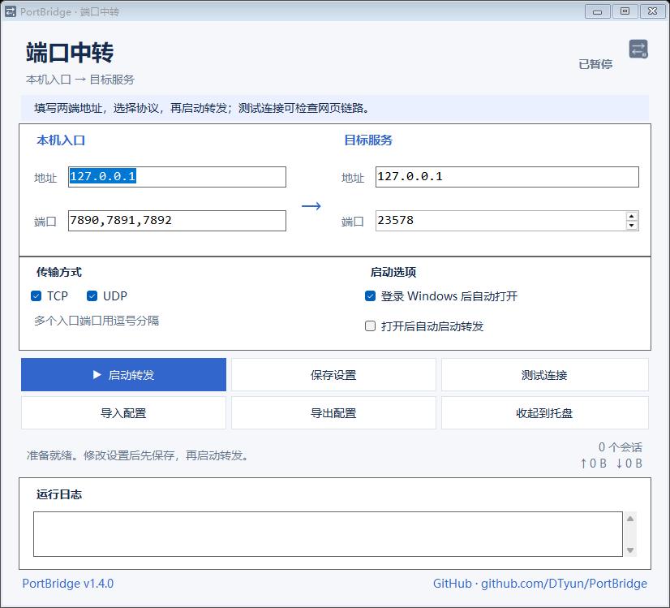
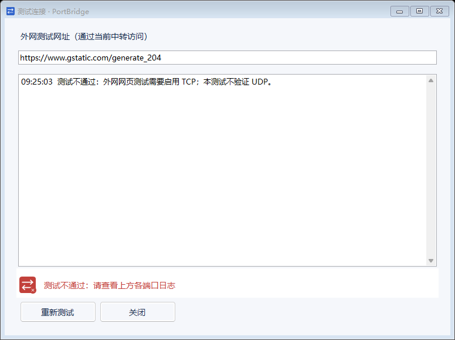

# PortBridge

一款面向 Windows 11 的轻量级本地端口中转工具。它把一个或多个本机端口的 TCP/UDP 流量转发到同一个目标服务，适合本地代理端口、开发服务和临时网络链路。

[](#)
[](LICENSE)

## 界面预览





## 适合谁

如果你只知道“本机有一个端口，希望把它转到另一个端口”，打开软件后按页面上的顺序填写即可。软件不要求安装 Node.js、Python 或额外运行库，Windows 11 可以直接运行 exe。

Windows 11 本地端口转发工具，单文件 exe，无需安装，使用系统自带 .NET Framework 4.x。

## 三步使用

v1.4 重新整理了主窗口：先看懂“本机入口 → 目标服务”，再按步骤保存、启动、测试；每个区域都有一句说明，日志和流量统计固定在底部。

1. 将 [`dist/PortBridge-v1.4.exe`](dist/PortBridge-v1.4.exe) 放到固定位置并双击打开。升级前先从旧版托盘菜单选择「退出软件」。程序使用 PortBridge 桌面图标，状态图标会随启动、运行、暂停和连接测试结果变化。
2. 默认监听 `127.0.0.1:7890`，目标为 `127.0.0.1:23578`。确认目标程序已经监听 23578。
3. 选择 TCP、UDP 或两者，点击「启动转发」。需要让使用方连接 7890，数据才会经过中转。
4. 「暂停转发」会关闭所有现有连接并释放监听端口。暂停后可修改设置，再次启动。
5. 最小化、关闭窗口或点击「收起到托盘」均继续后台运行。在右下角隐藏图标区域找到蓝色双向箭头，双击恢复窗口；右键可启动、暂停或退出。
6. 勾选「开机启动」后，当前用户登录 Windows 时软件自动收起到托盘。再勾选「打开软件时自动启动转发」，即可登录后自动转发。两个选项默认关闭。

## 多个监听端口（v1.3）

在左侧端口框填写 `7890,7891,7892`，这些端口统一转发到右侧同一个目标地址和端口。兼容中文逗号和逗号两侧的空格；每个端口须在 1–65535 之间，最多 64 个，重复项、空项和无效数字会提示错误。

点击启动或暂停会同时操作所有端口。任何端口启动失败，都会撤销本次已启动的监听，并显示具体失败端口。流量统计汇总全部端口。测试连接会逐个验证，所有端口成功才显示最终通过。

新配置写法：`<ListenPorts>7890,7891,7892</ListenPorts>`。仍可导入旧版 `<ListenPort>7890</ListenPort>` 配置；若两种字段同时存在，以 `ListenPorts` 为准。新版多端口配置请使用 v1.3 导入。

地址支持 IPv4、IPv6 或 `localhost`（解析为 127.0.0.1），不支持其他域名。默认只监听本机；设置为 `0.0.0.0` 可监听全部 IPv4 网卡，是否能从局域网连接还取决于 Windows 防火墙。程序不自动修改防火墙或系统代理。

## 测试连接（v1.1）

点击主窗口「测试连接」，弹出日志窗口并自动开始。默认访问 `https://www.gstatic.com/generate_204`，也可以修改网址后点击「重新测试」。

- 检查目标 TCP 端口，再实际连接监听端口，依次尝试 HTTP CONNECT、免认证 SOCKS5。
- 请求全程通过中转，不会通过直接访问外网替代链路测试。
- HTTPS 地址必须通过 TLS 握手和系统证书校验；网站返回 HTTP 2xx 才判定通过。重定向、认证要求、超时、端口不可用等都会记录原因并判定不通过。
- 暂停时临时启动中转，测试结束或取消后恢复暂停；正在运行时继续使用原有中转。
- 每种代理协议总计最多 20 秒，单次读写最多 8 秒。支持取消、重新测试。
- 本功能验证 TCP 网页链路，不证明 UDP 或全部网站可用。目标如果不是 HTTP/SOCKS5 代理，网页测试可能不适用。认证代理暂不支持输入用户名密码。
- 升级后如果需要开机启动，重新取消并勾选该选项，将启动路径更新到新版 exe。

这是 TCP/UDP 字节转发工具，不会转换 HTTP/SOCKS 协议，也不会自动捕获全电脑流量。如果 23578 是代理服务，7890 会转发到该代理；使用方需要采用目标代理支持的协议。TCP 支持半关闭；UDP 按来源地址映射回传，闲置 60–70 秒后回收，每种协议最多 256 个会话。

## 设置与移除

### 导入 / 导出配置（v1.2）

- 「导出配置」：将界面上的地址、端口、TCP、UDP、自动转发选项保存为 XML 文件，可自行选择保存位置。未点「保存设置」的有效输入也可以导出。
- 「导入配置」：选择 XML 文件，校验成功后应用到界面并保存。导入不会自动开始转发，点击「启动转发」即可使用。运行时需先暂停，才能导入。
- 压缩包附带 `PortBridge.config.xml` 示例，默认 `7890 → 23578`。可用记事本编辑，再通过按钮导入。
- 已有用户继续读取 `%LOCALAPPDATA%\PortBridge\settings.xml`。没有已保存设置时，才会读取 exe 同目录的 `PortBridge.config.xml` 作为初始配置。界面保存不会回写这个示例文件。
- 导入 / 导出不包含「开机启动」注册表选项，避免换电脑导入时改变登录启动行为。该选项请在目标电脑单独勾选。
- 无效 IP、越界端口、不启用任何协议、超大文件或非法 XML 会显示错误，不覆盖原有配置。

- 设置：`%LOCALAPPDATA%\PortBridge\settings.xml`，点击保存或启动时保存。运行日志只留在内存，不保存转发内容。
- 开机启动：当前用户注册表 `HKCU\Software\Microsoft\Windows\CurrentVersion\Run` 下的 `PortBridge` 项，无需管理员权限。
- 移动 exe 后，应在新位置重新取消并勾选开机启动，更新路径。
- 移除：先取消开机启动，再从托盘退出，然后删除 exe。可选删除上述设置目录。
- 端口占用时先暂停其他监听该端口的软件，或改用其他监听端口。

## 下载

主窗口底部显示当前版本号与 GitHub 开源地址。点击版本号打开发布版本页面，点击开源地址在默认浏览器打开 [DTyun/PortBridge](https://github.com/DTyun/PortBridge)。

优先下载带有 README 和示例配置的完整包：[`PortBridge-Win11-v1.4.zip`](dist/PortBridge-Win11-v1.4.zip)。也可以只下载 [`PortBridge-v1.4.exe`](dist/PortBridge-v1.4.exe)。GitHub Releases 中会同步提供同一个 zip 文件。

## 从源码构建

项目使用 Windows 自带的 .NET Framework C# 编译器，不依赖 NuGet：

```powershell
.\build.ps1
.\test.ps1
```

构建会生成 `assets/` 中的桌面与状态 ICO，将桌面图标嵌入 exe，并更新 `dist/PortBridge-Win11-v1.4.zip`（含 exe、配置示例和图标文件）。主程序位于 `dist/PortBridge-v1.4.exe`。

`test.ps1` 会运行 67 项检查，覆盖多端口 TCP/UDP 转发、端口冲突回滚、配置导入导出、HTTP CONNECT/SOCKS5 外网诊断、暂停重启、托盘窗口行为，以及 100%、125%、150% 程序化布局缩放下的控件遮挡检查。

## 项目结构

| 文件 | 作用 |
| --- | --- |
| `Program.cs` | 中文 WinForms 界面、托盘、配置导入导出、开机启动 |
| `IconArtwork.cs` | 端口箭头图形、运行状态图标和多尺寸 ICO 生成 |
| `IconAssetGenerator.cs` | 构建时生成桌面与状态 ICO 文件 |
| `assets/*.ico` | 桌面、启动中、运行、暂停、连接成功和失败图标 |
| `RelayEngine.cs` | TCP/UDP 转发引擎和多端口分组启动 |
| `ConnectionTest.cs` | HTTP CONNECT / SOCKS5 外网链路测试窗口 |
| `PortBridge.config.xml` | 可编辑的示例配置 |
| `build.ps1` | 构建 v1.4 exe |
| `test.ps1` / `Tests.cs` | 自动化回环和 UI 回归测试 |

## 开源说明

欢迎提交 Issue 和 Pull Request。请在修改网络转发逻辑时补充回环测试，并保持错误信息对新手可理解。外网测试默认只使用公共的 `https://www.gstatic.com/generate_204`，不会记录数据包内容。

## License

本项目使用 [MIT License](LICENSE)。

## 开发与验证

PowerShell 执行 `./build.ps1` 构建，`./test.ps1` 运行真实回环网络测试和原生窗体冒烟测试。源代码使用 Windows 自带 .NET Framework C# 编译器，不依赖 NuGet。`Program.cs` 为中文界面、托盘及启动设置，`RelayEngine.cs` 为转发核心。

构建产物未做发布者数字签名。开机启动实际登录行为需在用户选择开启后验证。
